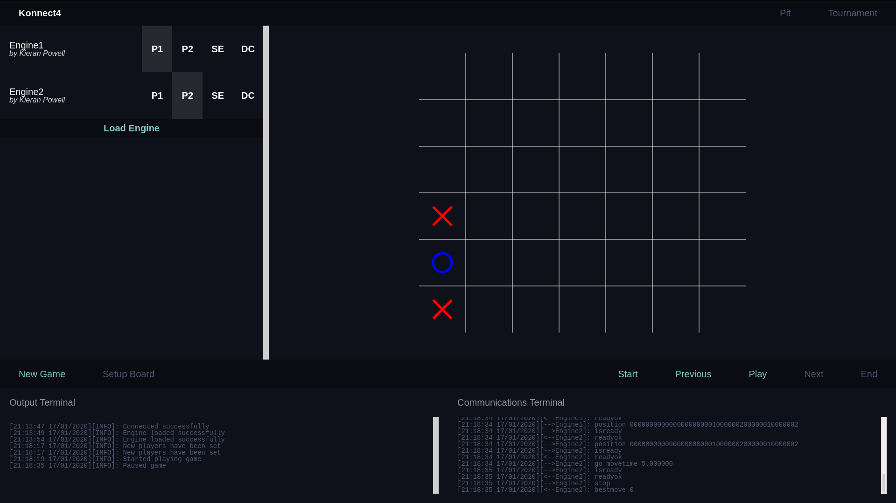
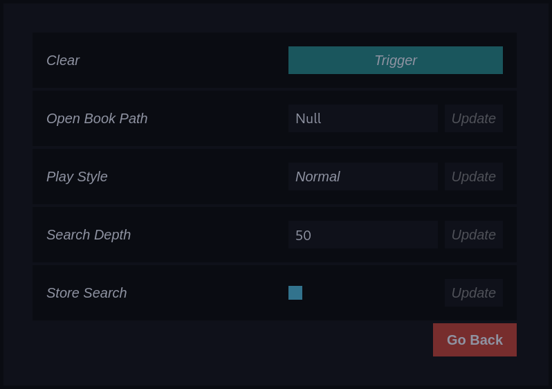
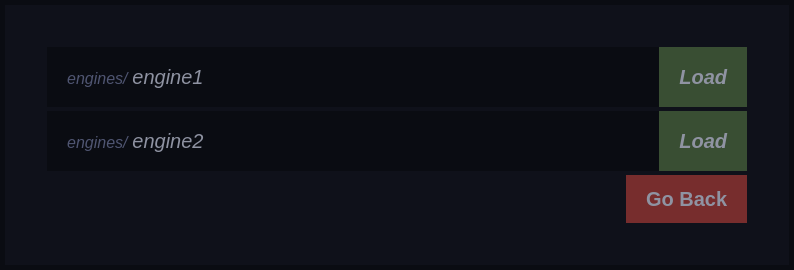

# Konnect4
Konnect4 is a web based GUI written in go for running and debugging connect 4 engines.


## Getting Started

### Prerequisites

First download this repository and extract it or use git to clone the repository:

```
$ git clone https://github.com/Kappeh/Konnect4.git
$ cd Konnect4
```

In order to build and/or run this software, you will need go installed on your computer.
[Download go](https://golang.org/dl/).

You will also need to aquire some dependency packages using the following command

```
$ go get
```

### Running

In order to run the web server, run the following command

```
$ go run *.go
```

Then use your favourite web browser to goto `localhost:8080`

### Building

If you are able to run the program successfully, you can build and run it

```
$ go -o Konnect4 build *.go
$ ./Konnect4
```

Running may vary on Windows / MacOS and have not been tested

## Engines

In the root directory of the project (or the executable file) create a directory called `engines`. Within this directory, put any engines which you wish to load into this program.

All engines should impliment the custom CFP protocol which is specified within [protocol.txt](https://github.com/Kappeh/Konnect4/blob/master/protocol.txt).

## The Develop User Interface



### Engine List

The engine list contains a list of all of the currently loaded engines.
Each engine can be set as player1, player2 or both by simply clicking the P1 and P2 buttons. Engine settings can be accessed by clicking the SE button. 



Finally, an engine can be disconnected by clicking the DC button.

To load a new engine, just click the load engine button and select the engine file which you wish to load from the menu.



### Controls

You can reset the game board to the start position with the new game button. When engines have been assigned to player1 and player2, you can set the game running with the play button and pause the game at any time.

When the game is paused you can use the view controls to look through the game history.

All other buttons are placeholders for future features.

### Output Terminals

The left terminal shows information and errors from the gui program and also information from the loaded engines.

The right terminal shows a list of all communications between Konnect4 and the loaded engines.

## Authors

* **Kieran Powell** - *Initial work* - [Kappeh](https://github.com/Kappeh)

See also the list of [contributors](https://github.com/Kappeh/Konnect4/contributors) who participated in this project.

## License

This project is licensed under the MIT License - see the [LICENSE.md](LICENSE.md) file for details
